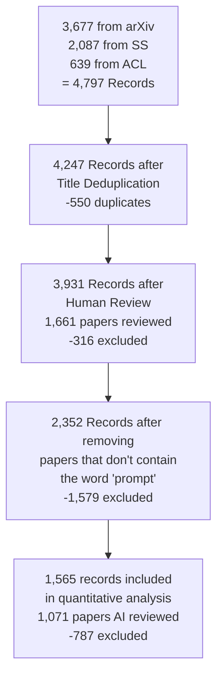

# 2 A Meta-Analysis of Prompting

## 2.1 Systematic Review Process

**Figure 2.1: PRISMA Systematic Literature Review Process**



Figure 2.1: The PRISMA systematic literature review process. We accumulate 4,247 unique records from which we extract 1,565 relevant records. 

In order to robustly collect a dataset of sources for this paper, we ran a systematic literature review grounded in the PRISMA process (Page et al., 2021) (Figure 2.1). We host this dataset on HuggingFace 4 and present a datasheet (Gebru et al., 2021) for the dataset in Appendix A.3. Our main data sources were arXiv, Semantic Scholar, and ACL. We query these databases with a list of 44 keywords narrowly related to prompting and prompt engineering (Appendix A.4). 

### 2.1.1 The Pipeline

In this section, we introduce our data scraping pipeline, which includes both human and LLM-assisted review.5 As an initial sample to establish filtering critera, we retrieve papers from arXiv based on a simple set of keywords and boolean rules (A.4). Then, human annotators label a sample of 1,661 articles from the arXiv set for the following criteria:

1. Include if the paper proposes a novel prompting technique. 

2. Include if the paper strictly covers hard prefix prompts. 

3. Exclude if the paper focuses on training by backpropagating gradients. 

4. Include if the paper uses a masked frame and/or window for non-text modalities. 

A set of 300 articles are reviewed independently by two annotators, with 92% agreement (Krippendorff's *α *= Cohen's *κ *= 81%). Next, we develop a prompt using gpt-4-1106-preview to classify the remaining articles (Appendix A.5). We validate the prompt against 100 ground-truth annotations, achieving 89% precision and 75% recall (for an *F * 1 of 81%). The combined human and LLM annotations generate a final set of 1,565 papers. 

4https://huggingface.co/datasets/PromptSystematicReview/Prompt\_Systematic\_Review\_Dataset

5Using gpt-4-1106-preview

## 2.2 Text-Based Techniques

We now present a comprehensive taxonomical ontology of 58 text-based prompting techniques, broken into 6 major categories (Figure 2.2). Although some of the techniques might fit into multiple categories, we place them in a single category of most relevance. 

```mermaid
graph TD
    A[Text-Based Prompt. Tech.] --> B[In-Context Learning 2.2.1]
    A --> C[Thought Generation 2.2.2]
    A --> D[Decomposition 2.2.3]
    A --> E[Ensembling 2.2.4]
    A --> F[Self-Criticism 2.2.5]
    A --> G[Answer Engineering 2.2.6]
    
    B --> B1[Few-Shot 2.2.1]
    B1 --> B11[Exemplar Ordering 2.2.1.1]
    B1 --> B12[Exemplar Selection 2.2.1.2]
    B12 --> B121[KNN 2.2.1.2]
    B12 --> B122[Vote-K 2.2.1.2]
    B12 --> B123[SG-ICL 2.2.1.2]
    B12 --> B124[Prompt Mining 2.2.1.2]
    B1 --> B13[Zero-Shot 2.2.1.3]
    B13 --> B131[Emotion Prompting 2.2.1.3]
    B13 --> B132[Role Prompting 2.2.1.3]
    B13 --> B133[Style Prompting 2.2.1.3]
    B13 --> B134[S2A 2.2.1.3]
    B13 --> B135[SimToM 2.2.1.3]
    B13 --> B136[RaR 2.2.1.3]
    B13 --> B137[RE2 2.2.1.3]
    B13 --> B138[Self-Ask 2.2.1.3]
    
    C --> C1[Chain-of-Thought CoT 2.2.2]
    C1 --> C11[Zero-Shot CoT 2.2.2.1]
    C11 --> C111[Step-Back Prompting 2.2.2.1]
    C11 --> C112[Analogical Prompting 2.2.2.1]
    C11 --> C113[Thread-of-Thought ThoT 2.2.2.1]
    C11 --> C114[Tab-CoT 2.2.2.1]
    C1 --> C12[Few-Shot CoT 2.2.2.2]
    C12 --> C121[Active-Prompt 2.2.2.2]
    C12 --> C122[Auto-CoT 2.2.2.2]
    C12 --> C123[Complexity-Based 2.2.2.2]
    C12 --> C124[Contrastive 2.2.2.2]
    C12 --> C125[Memory-of-Thought 2.2.2.2]
    C12 --> C126[Uncertainty-Routed CoT 2.2.2.2]
    
    E --> E1[Self-Consistency 2.2.4]
    E --> E2[DENSE 2.2.4]
    E --> E3[DiVeRSe 2.2.4]
    E --> E4[COSP 2.2.4]
    E --> E5[MoRE 2.2.4]
    E --> E6[Meta-CoT 2.2.4]
    E --> E7[Max Mutual Information 2.2.4]
```



Figure 2.2: All text-based prompting techniques from our dataset. 

### 2.2.1 In-Context Learning (ICL)

ICL refers to the ability of GenAIs to learn skills and tasks by providing them with exemplars and or relevant instructions within the prompt, without the need for weight updates/retraining (Brown et al., 2020; Radford et al., 2019b). These skills can be learned from exemplars (Figure 2.4) and/or instructions (Figure 2.5). Note that the word "learn" is misleading. ICL can simply be task specification–skills are not necessarily new, and can have already been included in the training data (Figure 2.6). See Appendix A.9 for a discussion of the use of this term. Significant work is currently being done on optimizing (Bansal et al., 2023) and understanding (Si et al., 2023a; Štefánik and Kadlčík, 2023) ICL.

**Few-Shot Prompting** (Brown et al., 2020) is the paradigm seen in Figure 2.4, where the GenAI learns to complete a task with only a few examples (exemplars). Few-shot prompting is a special case of Few-Shot Learning (FSL) (Fei-Fei et al., 2006; Wang et al., 2019), but does not require updating of model parameters.

#### 2.2.1.1 Few-Shot Prompting Design Decisions

Selecting exemplars for a prompt is a difficult task–performance depends significantly on various factors of the exemplars (Dong et al., 2023), and only a limited number of exemplars fit in the typical LLM's context window. We highlight six separate design decisions, including the selection and order of exemplars that critically influence the output quality (Zhao et al., 2021a; Lu et al., 2021; Ye and Durrett, 2023) (Figure 2.3).

**Figure 2.3: Few-Shot Prompting Design Decisions**

| Design Decision | Recommendation | Example |
|---|---|---|
| 1. Exemplar Quantity | Include as many exemplars as possible* | More examples generally improve performance |
| 2. Exemplar Ordering | Randomly order exemplars* | Order can dramatically affect results |
| 3. Exemplar Label Distribution | Provide a balanced label distribution* | Avoid bias toward overrepresented classes |
| 4. Exemplar Label Quality | Ensure exemplars are labeled correctly* | Incorrect labels may hurt performance |
| 5. Exemplar Format | Choose a common format* | Use consistent formatting patterns |
| 6. Exemplars Similarity | Select similar exemplars to the test instance* | Similar examples often work better |

*Please note that recommendations here do not generalize to all tasks; in some cases, each of them could hurt performance.

**Figure 2.4: ICL exemplar prompt**

```
2+2: four
4+5: nine
Trees are beautiful: Happy
I am so mad: Angry
I hate Pizza: Angry
I love life: Happy
8+0:
```

Alternative ordering:
```
Squirrels are so cute: Happy
I hate my boss: Angry
YouTube Ads Suck: Angry
Life is good: Happy
I'm so excited: 
```

**Figure 2.5: ICL instruction prompt**

```
Extract all words that have 3 of the same letter and at least 3 other letters from the following text: {TEXT}
```

**Examples comparing good vs. poor label quality:**

Good labeling:
```
I am so mad: Angry
I love life: Happy
I hate my boss: Angry
Life is good: Happy
I'm so excited: 
```

Poor labeling:
```
I am so mad: Happy
I love life: Angry
People are so dense: Angry
I hate my boss: Angry
Life is good: Happy
I'm so excited: 
```

**Exemplar Format Examples:**

Common format:
```
Im hyped!: Happy
Im not very excited: Angry
I'm so excited: 
```

Alternative format:
```
Trees are nice===Happy
YouTube Ads Suck===Angry
I'm so excited===
```

**Exemplar Quantity**: Increasing the quantity of exemplars in the prompt generally improves model performance, particularly in larger models (Brown et al., 2020). However, in some cases, the benefits may diminish beyond 20 exemplars (Liu et al., 2021). In the case of long context LLMs, additional exemplars continue to increase performance, though efficiency varies depending on task and model (Agarwal et al., 2024; Bertsch et al., 2024; Jiang et al., 2024).

**Exemplar Ordering**: The order of exemplars affects model behavior (Lu et al., 2021; Kumar and Talukdar, 2021; Liu et al., 2021; Rubin et al., 2022). On some tasks, exemplar order can cause accuracy to vary from sub-50% to 90%+ (Lu et al., 2021).

**Exemplar Label Distribution**: As in traditional supervised machine learning, the distribution of exemplar labels in the prompt affects behavior. For example, if 10 exemplars from one class and 2 exemplars of another class are included, this may cause the model to be biased toward the first class.

**Exemplar Label Quality**: Despite the general benefit of multiple exemplars, the necessity of strictly valid demonstrations is unclear. Some work (Min et al., 2022) suggests that the accuracy of labels is irrelevant—providing models with exemplars with incorrect labels may not negatively diminish performance. However, under certain settings, there is a significant impact on performance (Yoo et al., 2022). Larger models are often better at handling incorrect or unrelated labels (Wei et al., 2023c). It is important to discuss this factor, since if you are automatically constructing prompts from large datasets that may contain inaccuracies, it may be necessary to study how label quality affects your results.

**Exemplar Format**: The formatting of exemplars also affects performance. One of the most common formats is "Q: {input}, A: {label}", but the optimal format may vary across tasks; it may be worth trying multiple formats to see which performs best. There is some evidence to suggest that formats that occur commonly in the training data will lead to better performance (Jiang et al., 2020).

**Exemplar Similarity**: Selecting exemplars that are similar to the test sample is generally beneficial for performance (Liu et al., 2021; Min et al., 2022). However, in some cases, selecting more diverse exemplars can improve performance (Su et al., 2022; Min et al., 2022).

**Figure 2.6: ICL from training data prompt**

```
Translate the word "cheese" to French.
```

In this version of ICL, the model is not learning a new skill, but rather using knowledge likely in its training set.

**Figure 2.7: Few-Shot Prompting Template**

```
{Exemplars}
Dtest xi:
```

Here is the prompt template we will use for this section, following the 'input: output' format (Figure 2.4).

#### 2.2.1.2 Few-Shot Prompting Techniques

Considering all of these factors, Few-Shot Prompting can be very difficult to implement effectively. We now examine techniques for Few-Shot Prompting in the supervised setting.

Assume we have a training dataset, Dtrain, which contains multiple inputs Dtrain xi and outputs Dtrain yi, which can be used to few-shot prompt a GenAI (rather than performing gradient-based updates). Assume that this prompt can be dynamically generated with respect to Dtest xi at test time.

**K-Nearest Neighbor (KNN)** (Liu et al., 2021) is part of a family of algorithms that selects exemplars similar to Dtest xi to boost performance. Although effective, employing KNN during prompt generation may be time and resource intensive.

**Vote-K** (Su et al., 2022) is another method to select similar exemplars to the test sample. In one stage, a model proposes useful unlabeled candidate exemplars for an annotator to label. In the second stage, the labeled pool is used for Few-Shot Prompting. Vote-K also ensures that newly added exemplars are sufficiently different than existing ones to increase diversity and representativeness.

**Self-Generated In-Context Learning (SG-ICL)** (Kim et al., 2022) leverages a GenAI to automatically generate exemplars. While better than zero-shot scenarios when training data is unavailable, the generated samples are not as effective as actual data.

**Prompt Mining** (Jiang et al., 2020) is the process of discovering optimal "middle words" in prompts through large corpus analysis. These middle words are effectively prompt templates. For example, instead of using the common "Q: A:" format for few-shot prompts, there may exist something similar that occurs more frequently in the corpus. Formats which occur more often in the corpus will likely lead to improved prompt performance.

**Instruction Selection**: While instructions are required to guide LLMs in zero-shot prompts (Wei et al., 2022a), the benefits of adding instructions before exemplars in few-shot prompts is less clear. Ajith et al. (2024) show that generic, task-agnostic instructions (i.e., no instruction or "Complete the following task:") improve classification and question answering accuracy over task-specific ones (e.g., What is the answer to this question?) concluding instruction-following abilities can be achieved via exemplars alone. While they may not improve correctness, instructions in few-shot prompts can still guide auxiliary output attributes like writing style (Roy et al., 2023).

**More Complicated Techniques** such as LENS (Li and Qiu, 2023a), UDR (Li et al., 2023f), and Active Example Selection (Zhang et al., 2022a) leverage iterative filtering, embedding and retrieval, and reinforcement learning, respectively. Ensembling approaches can also benefit Few-Shot Prompting, but we discuss them separately (Section 2.2.4).

#### 2.2.1.3 Zero-Shot Prompting Techniques

In contrast to Few-Shot Prompting, Zero-Shot Prompting uses zero exemplars. There are a number of well-known standalone zero-shot techniques as well as zero-shot techniques combined with another concept (e.g. Chain of Thought), which we discuss later (Section 2.2.2).

**Role Prompting** (Wang et al., 2023j; Zheng et al., 2023d), also known as persona prompting (Schmidt et al., 2023; Wang et al., 2023l), assigns a specific role to the GenAI in the prompt. For example, the user might prompt it to act like "Madonna" or a "travel writer". This can create more desirable outputs for open-ended tasks (Reynolds and McDonell, 2021) and in some cases may improve accuracy on benchmarks (Zheng et al., 2023d).

**Figure 2.8: A One-Shot Chain-of-Thought Prompt**

```
Q: Jack has two baskets, each containing three balls. How many balls does Jack have in total? 

A: One basket contains 3 balls, so two baskets contain 3 * 2 = 6 balls. 

Q: {QUESTION}

A:
```

**Style Prompting** (Lu et al., 2023a) involves specifying the desired style, tone, or genre in the prompt to shape the output of a GenAI. A similar effect can be achieved using role prompting.

**Emotion Prompting** (Li et al., 2023a) incorporates phrases of psychological relevance to humans (e.g., "This is important to my career") into the prompt, which may lead to improved LLM performance on benchmarks and open-ended text generation.

**System 2 Attention (S2A)** (Weston and Sukhbaatar, 2023) first asks an LLM to rewrite the prompt and remove any information unrelated to the question therein. Then, it passes this new prompt into an LLM to retrieve a final response.

**SimToM** (Wilf et al., 2023) deals with complicated questions which involve multiple people or objects. Given the question, it attempts to establish the set of facts one person knows, then answer the question based only on those facts. This is a two prompt process and can help eliminate the effect of irrelevant information in the prompt.

**Self-Ask** (Press et al., 2022) prompts LLMs to first decide if they need to ask follow up questions for a given prompt. If so, the LLM generates these questions, then answers them and finally answers the original question.

### 2.2.2 Thought Generation

Thought generation encompasses a range of techniques that prompt the LLM to articulate its reasoning while solving a problem (Zhang et al., 2023c).

**Chain-of-Thought (CoT) Prompting** (Wei et al., 2022b) leverages few-shot prompting to encourage the LLM to express its thought process before delivering its final answer.6 This technique is occasionally referred to as Chain-of-Thoughts (Tutunov et al., 2023; Besta et al., 2024; Chen et al., 2023d). It has been demonstrated to significantly enhance the LLM's performance in mathematics and reasoning tasks. In Wei et al. (2022b), the prompt includes an exemplar featuring a question, a reasoning path, and the correct answer (Figure 2.8).

6We note that such techniques are often described using words like "think" that anthropomorphize models. We attempt not to use this language, but do use original authors' language where appropriate.

#### 2.2.2.1 Zero-Shot-CoT

The most straightforward version of CoT contains zero exemplars. It involves appending a thought inducing phrase like "Let's think step by step." (Kojima et al., 2022) to the prompt. Other suggested thought-generating phrases include "First, let's think about this logically" (Kojima et al., 2022). Zhou et al. (2022b) uses LLMs to generate "Let's work this out in a step by step way to be sure we have the right answer". Yang et al. (2023a) searches for an optimal thought inducer. Zero-Shot-CoT approaches are attractive as they don't require exemplars and are generally task agnostic.

**Rephrase and Respond (RaR)** (Deng et al., 2023) instructs the LLM to rephrase and expand the question before generating the final answer. For example, it might add the following phrase to the question: "Rephrase and expand the question, and respond". This could all be done in a single pass or the new question could be passed to the LLM separately. RaR has demonstrated improvements on multiple benchmarks.

**Re-reading (RE2)** (Xu et al., 2023) adds the phrase "Read the question again:" to the prompt in addition to repeating the question. Although this is such a simple technique, it has shown improvement in reasoning benchmarks, especially with complex questions.

**Step-Back Prompting** (Zheng et al., 2023c) is a modification of CoT where the LLM is first asked a generic, high-level question about relevant concepts or facts before delving into reasoning. This approach has improved performance significantly on multiple reasoning benchmarks for both PaLM-2L and GPT-4.

**Analogical Prompting** (Yasunaga et al., 2023) is similar to SG-ICL, and automatically generates exemplars that include CoTs. It has demonstrated improvements in mathematical reasoning and code generation tasks.

**Thread-of-Thought (ThoT) Prompting** (Zhou et al., 2023) consists of an improved thought inducer for CoT reasoning. Instead of "Let's think step by step," it uses "Walk me through this context in manageable parts step by step, summarizing and analyzing as we go." This thought inducer works well in question-answering and retrieval settings, especially when dealing with large, complex contexts.

**Tabular Chain-of-Thought (Tab-CoT)** (Jin and Lu, 2023) consists of a Zero-Shot CoT prompt that makes the LLM output reasoning as a markdown table. This tabular design enables the LLM to improve the structure and thus the reasoning of its output.

#### 2.2.2.2 Few-Shot CoT

This set of techniques presents the LLM with multiple exemplars, which include chains-of-thought. This can significantly enhance performance. This technique is occasionally referred to as Manual-CoT (Zhang et al., 2022b) or Golden CoT (Del and Fishel, 2023).

**Complexity-based Prompting** (Fu et al., 2023b) involves two major modifications to CoT. First, it selects complex examples for annotation and inclusion in the prompt, based on factors like question length or reasoning steps required. Second, during inference, it samples multiple reasoning chains (answers) and uses a majority vote among chains exceeding a certain length threshold, under the premise that longer reasoning indicates higher answer quality. This technique has shown improvements on three mathematical reasoning datasets.

**Active Prompting** (Diao et al., 2023) starts with some training questions/exemplars, asks the LLM to solve them, then calculates uncertainty (disagreement in this case) and asks human annotators to rewrite the exemplars with highest uncertainty.

**Memory-of-Thought Prompting** (Li and Qiu, 2023b) leverage unlabeled training exemplars to build Few-Shot CoT prompts at test time. Before test time, it performs inference on the unlabeled training exemplars with CoT. At test time, it retrieves similar instances to the test sample. This technique has shown substantial improvements in benchmarks like Arithmetic, commonsense, and factual reasoning.

**Automatic Chain-of-Thought (Auto-CoT) Prompting** (Zhang et al., 2022b) uses Wei et al. (2022b)'s Zero-Shot prompt to automatically generate chains of thought. These are then used to build a Few-Shot CoT prompt for a test sample.

### 2.2.3 Decomposition

Significant research has focused on decomposing complex problems into simpler sub-questions. This is an effective problem-solving strategy for humans as well as GenAI (Patel et al., 2022). Some decomposition techniques are similar to thought-inducing techniques, such as CoT, which often naturally breaks down problems into simpler components. However, explicitly breaking down problems can further improve LLMs' problem solving ability.

**Least-to-Most Prompting** (Zhou et al., 2022a) starts by prompting a LLM to break a given problem into sub-problems without solving them. Then, it solves them sequentially, appending model responses to the prompt each time, until it arrives at a final result. This method has shown significant improvements in tasks involving symbolic manipulation, compositional generalization, and mathematical reasoning.

**Decomposed Prompting (DECOMP)** (Khot et al., 2022) Few-Shot prompts a LLM to show it how to use certain functions. These might include things like string splitting or internet searching; these are often implemented as separate LLM calls. Given this, the LLM breaks down its original problem into sub-problems which it sends to different functions. It has shown improved performance over Least-to-Most prompting on some tasks.

**Contrastive CoT Prompting** (Chia et al., 2023) adds both exemplars with incorrect and correct explanations to the CoT prompt in order to show the LLM how not to reason. This method has shown significant improvement in areas like Arithmetic Reasoning and Factual QA.

**Uncertainty-Routed CoT Prompting** (Google, 2023) samples multiple CoT reasoning paths, then selects the majority if it is above a certain threshold (calculated based on validation data). If not, it samples greedily and selects that response. This method demonstrates improvement on the MMLU benchmark for both GPT-4 and Gemini Ultra models.

**Program-of-Thoughts** (Chen et al., 2023d) uses LLMs like Codex to generate programming code as reasoning steps. A code interpreter executes these steps to obtain the final answer. It excels in mathematical and programming-related tasks but is less effective for semantic reasoning tasks.

**Faithful Chain-of-Thought** (Lyu et al., 2023) generates a CoT that has both natural language and symbolic language (e.g. Python) reasoning, just like Program-of-Thoughts. However, it also makes use of different types of symbolic languages in a task-dependent fashion.

**Skeleton-of-Thought** (Ning et al., 2023) focuses on accelerating answer speed through parallelization. Given a problem, it prompts an LLM to create a skeleton of the answer, in a sense, sub-problems to be solved. Then, in parallel, it sends these questions to a LLM and concatenates all the outputs to get a final response.

**Plan-and-Solve Prompting** (Wang et al., 2023f) consists of an improved Zero-Shot CoT prompt, "Let's first understand the problem and devise a plan to solve it. Then, let's carry out the plan and solve the problem step by step". This method generates more robust reasoning processes than standard Zero-Shot-CoT on multiple reasoning datasets.

**Tree-of-Thought (ToT)** (Yao et al., 2023b), also known as Tree of Thoughts, (Long, 2023), creates a tree-like search problem by starting with an initial problem then generating multiple possible steps in the form of thoughts (as from a CoT). It evaluates the progress each step makes towards solving the problem (through prompting) and decides which steps to continue with, then keeps creating more thoughts. ToT is particularly effective for tasks that require search and planning.

**Recursion-of-Thought** (Lee and Kim, 2023) is similar to regular CoT. However, every time it encounters a complicated problem in the middle of its reasoning chain, it sends this problem into another prompt/LLM call. After this is completed, the answer is inserted into the original prompt. In this way, it can recursively solve complex problems, including ones which might otherwise run over that maximum context length. This method has shown improvements on arithmetic and algorithmic tasks. Though implemented using fine-tuning to output a special token that sends sub-problem into another prompt, it could also be done only through prompting.

**Metacognitive Prompting** (Wang and Zhao, 2024) attempts to make the LLM mirror human metacognitive processes with a five part prompt chain, with steps including clarifying the question, preliminary judgement, evaluation of response, decision confirmation, and confidence assessment.

### 2.2.4 Ensembling

In GenAI, ensembling is the process of using multiple prompts to solve the same problem, then aggregating these responses into a final output. In many cases, a majority vote—selecting the most frequent response—is used to generate the final output. Ensembling techniques reduce the variance of LLM outputs and often improving accuracy, but come with the cost of increasing the number of model calls needed to reach a final answer.

**Demonstration Ensembling (DENSE)** (Khalifa et al., 2023) creates multiple few-shot prompts, each containing a distinct subset of exemplars from the training set. Next, it aggregates over their outputs to generate a final response.

**Mixture of Reasoning Experts (MoRE)** (Si et al., 2023d) creates a set of diverse reasoning experts by using different specialized prompts for different reasoning types (such as retrieval augmentation prompts for factual reasoning, Chain-of-Thought reasoning for multi-hop and math reasoning, and generated knowledge prompting for commonsense reasoning). The best answer from all experts is selected based on an agreement score.

**Max Mutual Information Method** (Sorensen et al., 2022) creates multiple prompt templates with varied styles and exemplars, then selects the optimal template as the one that maximizes mutual information between the prompt and the LLM's outputs.

**Self-Consistency** (Wang et al., 2022) is based on the intuition that multiple different reasoning paths can lead to the same answer. This method first prompts the LLM multiple times to perform CoT, crucially with a non-zero temperature to elicit diverse reasoning paths. Next, it uses a majority vote over all generated responses to select a final response. Self-Consistency has shown improvements on arithmetic, commonsense, and symbolic reasoning tasks.

**Prompt Paraphrasing** (Jiang et al., 2020) transforms an original prompt by changing some of the wording, while still maintaining the overall meaning. It is effectively a data augmentation technique that can be used to generate prompts for an ensemble.

### 2.2.5 Self-Criticism

When creating GenAI systems, it can be useful to have LLMs criticize their own outputs (Huang et al., 2022). This could simply be a judgement (e.g., is this output correct) or the LLM could be prompted to provide feedback, which is then used to improve the answer. Many approaches to generating and integrating self-criticism have been developed.

**Self-Calibration** (Kadavath et al., 2022) first prompts an LLM to answer a question. Then, it builds a new prompt that includes the question, the LLM's answer, and an additional instruction asking whether the answer is correct. This can be useful for gauging confidence levels when applying LLMs when deciding when to accept or revise the original answer.

**Self-Refine** (Madaan et al., 2023) is an iterative framework where, given an initial answer from the LLM, it prompts the same LLM to provide feedback on the answer, and then prompts the LLM to improve the answer based on the feedback. This iterative process continues until a stopping condition is met (e.g., max number of steps reached). Self-Refine has demonstrated improvement across a range of reasoning, coding, and generation tasks.

**Reversing Chain-of-Thought (RCoT)** (Xue et al., 2023) first prompts LLMs to reconstruct the problem based on generated answer. Then, it generates fine-grained comparisons between the original problem and the reconstructed problem as a way to check for any inconsistencies. These inconsistencies are then converted to feedback for the LLM to revise the generated answer.

**Universal Self-Consistency** (Chen et al., 2023e) is similar to Self-Consistency except that rather than selecting the majority response by programmatically counting how often it occurs, it inserts all outputs into a prompt template that selects the majority answer. This is helpful for free-form text generation and cases where the same answer may be output slightly differently by different prompts.

**Meta-Reasoning over Multiple CoTs** (Yoran et al., 2023) is similar to universal Self-Consistency; it first generates multiple reasoning chains (but not necessarily final answers) for a given problem. Next, it inserts all of these chains in a single prompt template then generates a final answer from them.

**DiVeRSe** (Li et al., 2023i) creates multiple prompts for a given problem then performs Self-Consistency for each, generating multiple reasoning paths. They score reasoning paths based on each step in them then select a final response.

**Consistency-based Self-adaptive Prompting (COSP)** (Wan et al., 2023a) constructs Few-Shot CoT prompts by running Zero-Shot CoT with Self-Consistency on a set of examples then selecting a high agreement subset of the outputs to be included in the final prompt as exemplars. It again performs Self-Consistency with this final prompt.

**Universal Self-Adaptive Prompting (USP)** (Wan et al., 2023b) builds upon the success of COSP, aiming to make it generalizable to all tasks. USP makes use of unlabeled data to generate exemplars and a more complicated scoring function to select them. Additionally, USP does not use Self-Consistency.

**Self-Verification** (Weng et al., 2022) generates multiple candidate solutions with Chain-of-Thought (CoT). It then scores each solution by masking certain parts of the original question and asking an LLM to predict them based on the rest of the question and the generated solution. This method has shown improvement on eight reasoning datasets.

**Chain-of-Verification (COVE)** (Dhuliawala et al., 2023) first uses an LLM to generate an answer to a given question. Then, it creates a list of related questions that would help verify the correctness of the answer. Each question is answered by the LLM, then all the information is given to the LLM to produce the final revised answer. This method has shown improvements in various question-answering and text-generation tasks.

**Cumulative Reasoning** (Zhang et al., 2023b) first generates several potential steps in answering the question. It then has a LLM evaluate them, deciding to either accept or reject these steps. Finally, it checks whether it has arrived at the final answer. If so, it terminates the process, but otherwise it repeats it. This method has demonstrated improvements in logical inference tasks and mathematical problem.

## 2.3 Prompting Technique Usage

As we have just seen, there exist many text-based prompting techniques. However, only a small subset of them are commonly used in research and in industry. We measure technique usage by proxy of measuring the number of citations by other papers in our dataset. We do so with the presumption that papers about prompting are more likely to actually use or evaluate the cited technique. We graph the top 25 papers cited in this way from our dataset and find that most of them propose new prompting techniques (Figure 2.11). The prevalence of citations for Few-Shot and Chain-of-Thought prompting is unsurprising and helps to establish a baseline for understanding the prevalence of other techniques.

### 2.3.1 Benchmarks

In prompting research, when researchers propose a new technique, they usually benchmark it across multiple models and datasets. This is important to prove the utility of the technique and examine how it transfers across models.

In order to make it easier for researchers proposing new techniques to know how to benchmark them, we quantitatively examine which models (Figure 2.9) and what benchmark datasets (Figure 2.10) are being used. Again, we measure usage by how many times papers in our dataset cite the benchmark datasets and models.

To find which datasets and models are being used, we prompted GPT-4-1106-preview to extract any mentioned dataset or model from the body of papers in our dataset. After, we manually filtered out results that were not models or datasets. The citation counts were acquired by searching items from the finalized list on Semantic Scholar.

## 2.4 Prompt Engineering

In addition to surveying prompting techniques, we also review prompt engineering techniques, which are used to automatically optimize prompts. We discuss some techniques that use gradient updates, since the set of prompt engineering techniques is much smaller than that of prompting techniques.

**Meta Prompting** is the process of prompting a LLM to generate or improve a prompt or prompt template (Reynolds and McDonell, 2021; Zhou et al., 2022b; Ye et al., 2023). This is often done without any scoring mechanism, using just a simple template (Figure 2.12). However, other works present more complex uses of meta-prompting, with multiple iterations and scoring mechanisms Yang et al. (2023a); Fernando et al. (2023).

**Figure 2.12: A simple Meta Prompting template**

```
Improve the following prompt: {PROMPT}
```

**AutoPrompt** (Shin et al., 2020b) uses a frozen LLM as well as a prompt template that includes some "trigger tokens", whose values are updated via backpropogation at training time. This is a version of soft-prompting.

**Automatic Prompt Engineer (APE)** (Zhou et al., 2022b) uses a set of exemplars to generate a Zero-Shot instruction prompt. It generates multiple possible prompts, scores them, then creates variations of the best ones (e.g. by using prompt paraphrasing). It iterates on this process until some desiderata are reached.

**Gradientfree Instructional Prompt Search (GrIPS)** (Prasad et al., 2023) is similar to APE, but uses a more complex set of operations including deletion, addition, swapping, and paraphrasing in order to create variations of a starting prompt.

**Prompt Optimization with Textual Gradients (ProTeGi)** (Pryzant et al., 2023) is a unique approach to prompt engineering that improves a prompt template through a multi-step process. First, it passes a batch of inputs through the template, then passes the output, ground truth, and prompt into another prompt that criticizes the original prompt. It generates new prompts from these criticisms then uses a bandit algorithm (Gabillon et al., 2011) to select one. ProTeGi demonstrates improvements over methods like APE and GRIPS.

**RLPrompt** (Deng et al., 2022) uses a frozen LLM with an unfrozen module added. It uses this LLM to generate prompt templates, scores the templates on a dataset, and updates the unfrozen module using Soft Q-Learning (Guo et al., 2022). Interestingly, the method often selects grammatically nonsensical text as the optimal prompt template.

**Dialogue-comprised Policy-gradient-based Discrete Prompt Optimization (DP2O)** (Li et al., 2023b) is perhaps the most complicated prompt engineering technique, involving reinforcement learning, a custom prompt scoring function, and conversations with an LLM to construct the prompt.

## 2.5 Answer Engineering

Answer engineering is the iterative process of developing or selecting among algorithms that extract precise answers from LLM outputs. To understand the need for answer engineering, consider a binary classification task where the labels are "Hate Speech" and "Not Hate Speech". The prompt template might look like this:

```
Is this "Hate Speech" or "Not Hate Speech": {TEXT}
```

When a hate speech sample is put through the template, it might have outputs such as "It's hate speech", "Hate Speech.", or even "Hate speech, because it uses negative language against a racial group". This variance in response formats is difficult to parse consistently; improved prompting can help, but only to a certain extent.

There are three design decisions in answer engineering, the choice of answer space, answer shape, and answer extractor (Figure 2.13). Liu et al. (2023b) define the first two as necessary components of answer engineering and we append the third. We consider answer engineering to be distinct from prompt engineering, but extremely closely related; the processes are often conducted in tandem.

**Figure 2.13: An annotated output of a LLM output for a labeling task**

```
LLM Response

Likely Negative

Answer Shape:
A span of tokens

This is negative
NEGATIVE! 

Answer Space:
All possible spans of tokens

Answer Extraction:
Select the proper label
```

This shows the three design decisions of answer engineering: the choice of answer shape, space, and extractor. Since this is an output from a classification task, the answer shape could be restricted to a single token and the answer space to one of two tokens ("positive" or "negative"), though they are unrestricted in this image.

### 2.5.1 Answer Shape

The shape of an answer is its physical format. For example, it could be a token, span of tokens, or even an image or video.7 It is sometimes useful to restrict the output shape of a LLM to a single token for tasks like binary classification.

### 2.5.2 Answer Space

The space of an answer is the domain of values that its structure may contain. This may simply be the space of all tokens, or in a binary labeling task, could just be two possible tokens.

### 2.5.3 Answer Extractor

In cases where it is impossible to entirely control the answer space (e.g. consumer-facing LLMs), or the expected answer may be located somewhere within the model output, a rule can be defined to extract the final answer. This rule is often a simple function (e.g. a regular expression), but can also use a separate LLM to extract the answer.

**Verbalizer**: Often used in labeling tasks, a verbalizer maps a token, span, or other type of output to a label and vice-versa (injective) (Schick and Schütze, 2021). For example, if we wish for a model to predict whether a Tweet is positive or negative, we could prompt it to output either "+" or "-" and a verbalizer would map these token sequences to the appropriate labels. The selection of a verbalizer constitutes a component of answer engineering.

**Regex**: As mentioned previously, Regexes are often used to extract answers. They are usually used to search for the first instance of a label. However, depending on the output format and whether CoTs are generated, it may be better to search for the last instance.

**Separate LLM**: Sometimes outputs are so complicated that regexes won't work consistently. In this case, it can be useful to have a separate LLM evaluate the output and extract an answer. This separate LLM will often use an answer trigger (Kojima et al., 2022), e.g. "The answer (Yes or No) is", to extract the answer.

7We use a different definition than Liu et al. (2023b) with respect to granularity (e.g. token vs span), since the output could be of a different modality.

**Figure 2.9: Model Mention Counts in Dataset**

| Model Name | Mentions |
|------------|----------|
| GPT | 800+ |
| BERT | 600+ |
| LLaMA | 400+ |
| Codex | 300+ |
| InstructGPT | 250+ |
| OPT | 200+ |
| BLOOM | 150+ |
| PaLM | 150+ |
| CLIP | 100+ |
| Lambda | 75+ |

**Figure 2.10: Dataset Mention Counts in Prompting Papers**

| Dataset Name | Mentions |
|--------------|----------|
| GSM8K | 200+ |
| BBH | 150+ |
| CommonsenseQA | 120+ |
| HellaSwag | 100+ |
| BIG-bench | 90+ |
| WinoGrande | 80+ |
| QASC | 70+ |
| AQUA-RAT | 60+ |
| TruthfulQA | 50+ |

**Figure 2.11: Citation Counts of Prompting Techniques**

The top 25 papers in our dataset, measured by how often they are cited by other papers in our dataset. Most papers here are prompting techniques*, and the remaining papers contain prompting advice.

| Technique | Citations |
|-----------|-----------|
| Chain-of-Thought* | 400+ |
| Self-Consistency* | 250+ |
| Zero-Shot Reasoning* | 200+ |
| Few-Shot Prompting* | 180+ |
| Automatic CoT* | 150+ |
| Tree of Thoughts* | 120+ |
| Step-Back Prompting* | 100+ |
| Self-Ask* | 90+ |
| Program of Thoughts* | 80+ |
| Graph of Thoughts* | 70+ |
| Plan-and-Solve Prompting* | 60+ |
| Faithful CoT* | 50+ |
| Memory-of-Thought* | 45+ |
| Self-Evaluation* | 40+ |
| Maieutic Prompting* | 35+ |

*Techniques marked with asterisk are novel prompting methods proposed in the respective papers.

**ProTeGi** takes a batch of inputs through the template, then passes the output, ground truth, and prompt into another prompt that criticizes the original prompt. It generates new prompts from these criticisms then uses a bandit algorithm (Gabillon et al., 2011) to select one. ProTeGi demonstrates improvements over methods like APE and GRIPS.

**RLPrompt** (Deng et al., 2022) uses a frozen LLM with an unfrozen module added. It uses this LLM to generate prompt templates, scores the templates on a dataset, and updates the unfrozen module using Soft Q-Learning (Guo et al., 2022). Interestingly, the method often selects grammatically nonsensical text as the optimal prompt template.

**Figure 2.13: Answer Engineering Design Decisions**

```
LLM Response: "This is negative NEGATIVE!"

Answer Shape: A span of tokens
Answer Space: All possible spans of tokens  
Answer Extraction: Select the proper label
Result: "Likely Negative"
```

Figure 2.13: An annotated output of a LLM output for a labeling task, which shows the three design decisions of answer engineering: the choice of answer shape, space, and extractor. Since this is an output from a classification task, the answer shape could be restricted to a single token and the answer space to one of two tokens ("positive" or "negative"), though they are unrestricted in this image.

**Dialogue-comprised Policy-gradient-based Discrete Prompt Optimization (DP2O)** (Li et al., 2023b) is perhaps the most complicated prompt engineering technique, involving reinforcement learning, a custom prompt scoring function, and conversations with an LLM to construct the prompt.

## 2.5 Answer Engineering

Answer engineering is the iterative process of developing or selecting among algorithms that extract precise answers from LLM outputs. To understand the need for answer engineering, consider a binary classification task where the labels are "Hate Speech" and "Not Hate Speech". The prompt template might look like this:

```
Is this "Hate Speech" or "Not Hate Speech": {TEXT}
```

When a hate speech sample is put through the template, it might have outputs such as "It's hate speech" or other variations that don't exactly match the expected labels.

### 2.5.1 Answer Shape

The shape of an answer is its physical format. For example, it could be a token, span of tokens, or even an image or video.7 It is sometimes useful to restrict the output shape of a LLM to a single token for tasks like binary classification.

### 2.5.2 Answer Space

The space of an answer is the domain of values that its structure may contain. This may simply be the space of all tokens, or in a binary labeling task, could just be two possible tokens.

### 2.5.3 Answer Extractor

In cases where it is impossible to entirely control the answer space (e.g. consumer-facing LLMs), or the expected answer may be located somewhere within the model output, a rule can be defined to extract the final answer. This rule is often a simple function (e.g. a regular expression), but can also use a separate LLM to extract the answer.

For example, outputs might include variations like "speech", "Hate Speech.", or even "Hate speech, because it uses negative language against a racial group". This variance in response formats is difficult to parse consistently; improved prompting can help, but only to a certain extent.

There are three design decisions in answer engineering: the choice of answer space, answer shape, and answer extractor (Figure 2.13). Liu et al. (2023b) define the first two as necessary components of answer engineering and we append the third. We consider answer engineering to be distinct from prompt engineering, but extremely closely related; the processes are often conducted in tandem.

**Verbalizer**: Often used in labeling tasks, a verbalizer maps a token, span, or other type of output to a label and vice-versa (injective) (Schick and Schütze, 2021). For example, if we wish for a model to predict whether a Tweet is positive or negative, we could prompt it to output either "+" or "-" and a verbalizer would map these token sequences to the appropriate labels. The selection of a verbalizer constitutes a component of answer engineering.

**Regex**: Regular expressions can be used to extract specific patterns from LLM outputs. As mentioned previously, regexes are often used to extract answers. They are usually used to search for the first instance of a label. However, depending on the output format and whether CoTs are generated, it may be better to search for the last instance.

**Separate LLM**: Sometimes outputs are so complicated that regexes won't work consistently. In this case, it can be useful to have a separate LLM evaluate the output and extract an answer. This separate LLM will often use an answer trigger (Kojima et al., 2022), e.g. "The answer (Yes or No) is", to extract the answer.

7We use a different definition than Liu et al. (2023b) with respect to granularity (e.g. token vs span), since the output could be of a different modality.